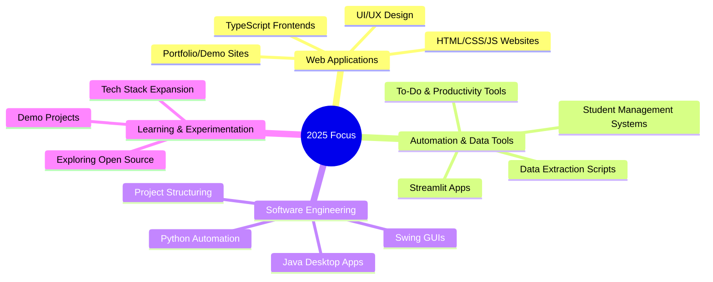

  

<!-- SOCIAL LINKS -->

  <!-- Replace LINK placeholders with your actual URLs -->
  
  
  
  
  

## 🚀 About Me

  

> **Empowering future software engineers with hands-on, real-world technology skills.**

My focus is on delivering practical, up-to-date training in software engineering and application development, blending foundational programming with modern web, mobile, and automation technologies. Through project-based learning and real-world examples, I help students and professionals build the confidence and capability to solve real problems with code.

**Current Focus:**  

- Mentoring and teaching aspiring software engineers via interactive, project-driven courses  
- Modern software development using Java, Python, C++, C#, VB.NET, PHP, HTML5, CSS, JavaScript, TypeScript  
- Building robust applications for web, desktop, and mobile platforms  
- Integrating databases (SQL Server, MySQL) and cloud concepts  
- Mobile and game development with Android, Xamarin, Kotlin, Swift  
- Strong emphasis on core programming, system analysis/design, and practical problem solving

## 👨‍🏫 What I Teach

I guide learners from the very basics of programming to advanced, industry-ready software and application development. My teaching approach is hands-on and project-based, helping students master both theory and practical skills needed for modern tech careers.

 

I specialize in:

- Introducing beginners to software engineering fundamentals  
- Building web, desktop, and mobile applications with real-world tools and languages  
- Rapid prototyping and full-stack development  
- Bridging the gap between theory and practice, so learners can confidently tackle real industry challenges

## 🛠️ Technical Toolkit

  
### Core Specializations

### Technology Stack

---

## 🎯 Domain Expertise

### 💻 Software & Web Development

*Websites • GUI Apps • Mobile & Game Apps • Rapid Application Development*

### ⚙️ Automation & Data Tools

*Data Extraction • Scripting • Databases • Interactive Dashboards*

### 🚀 Learning & Experimentation

*Trying New Tech • Sharing Knowledge • Exploring Open Source*

## 🌟 Featured Projects

### 🏢 StudentManagementGUI

A Java Swing application for managing student records. Features a user-friendly interface for CRUD operations, search, and record management.  
**Your Role:** Sole developer; designed and implemented the full Java desktop GUI.

---

### 🏢 mcq_system

A Python-based command-line MCQ (Multiple Choice Question) system for quizzes and tests.  
**Your Role:** Developed the core logic, CLI, and question/answer management.

---

### 🏢 WoodenCatalogue

A TypeScript project to catalogue wooden products, likely with a frontend interface for browsing and management.  
**Your Role:** Developed TypeScript components and basic UI.

---

### 🏢 DataPriceExtractor

A web tool that extracts data and prices from a Geonettech bundle page.  
**Your Role:** Built the HTML UI and implemented extraction logic.

---

### 🏢 streamlit_mcq

A Streamlit-based MCQ quiz app for interactive assessments in the browser.  
**Your Role:** Developed Streamlit interface and quiz logic.

---

### 🏢 todo-app

A simple Java-based To-Do application.  
**Your Role:** End-to-end development of the logic and UI.

---

## 🏆 Professional Certifications

<!-- Add your certifications below as available -->
<!-- Example:
- Microsoft Certified: Azure Fundamentals
- AWS Certified Solutions Architect - Associate
- Google Data Analytics Certificate
-->

<!-- Badges/links: -->

---

## 📊 GitHub Analytics

  

<table>
<tr>
<td align="center">
  
</td>
<td align="center">
  
</td>
<td align="center">
  
</td>
</tr>
</table>

---

### 🎯 Strategic Development Areas

